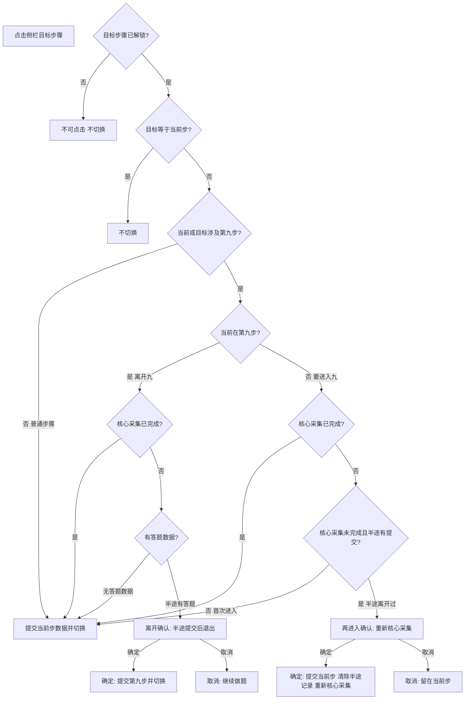
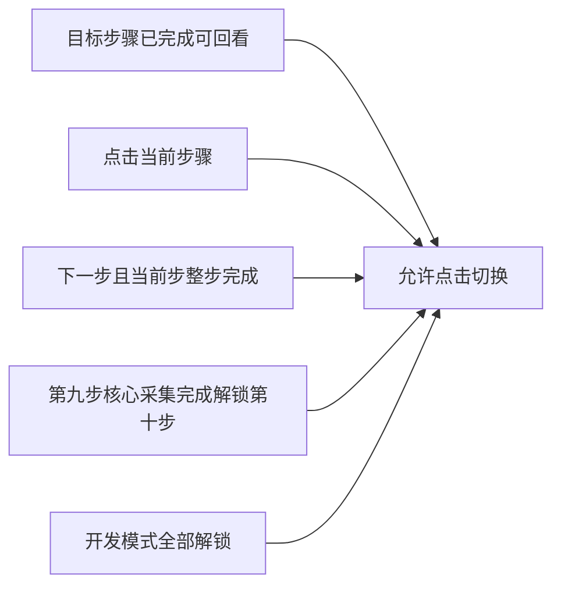

# 侧栏切换步骤 — 完整逻辑

## 结论（你的判断是对的，逻辑可大幅简化）

**是的。** 第九步导航只需盯住一个分界：**「核心采集是否完成」**（反测阶段 + 测量剩余点位）。在此之前才可能弹窗；在此之后（含补测、收工）全部按普通步骤 **无感切换 + 提交当前步**。

| 层级 | 含义 | 代码锚点 | 影响侧栏切换 |
|------|------|----------|--------------|
| **核心采集完成** | 反测结束且剩余点位自动采完 | `phase >= 5` → `coreCollectionDone: true` | **第十步侧栏解锁**；切换无弹窗（关键分界） |
| **整步完成** | 收工完毕，`onNext` 提交 | `completedSteps.has('9')` | 第十步已解锁；切换无弹窗；计入成绩/完成态 |
| **核心采集中** | 正测/反测/manual 点位进行中 | `phase < 5` 且有 `recordedAnswers` | **可能弹窗**（唯一特殊区间） |
| **未开始** | 刚进入，尚未产生答题 | 无 `recordedAnswers` | 无感切换 |

**补测、收工是核心采集完成后的增量操作**，不改变导航规则：用户可离开去做别的步骤，再回来继续补测/收工，**不触发**离开/再进入确认（但仍提交当前步数据）。

**简化后的唯一拦截条件：**

```ts
needsStep9Confirm =
  hasStep9Progress(stepData) && !isStep9CoreCollectionDone(stepData)
// isStep9CoreCollectionDone ≡ stepData['9']?.coreCollectionDone === true
```

不再用 `completedSteps.has('9')` 区分弹窗与否——整步完成与核心采集完成后行为一致（均无弹窗）。

---

## 一、总体大框架（所有步骤）

### 1.1 侧栏解锁

- **第 1～8 步、第 10～12 步：** 完成当前步内容后解锁下一步（各步完成条件后续补充，通常 `onNext` → `completedSteps`）。
- **第 9 步 → 第 10 步（特殊）：** **核心采集完成**（`coreCollectionDone`）即解锁第十步，**不必等**收工 `onNext`。
- 已完成的步骤可随时回看。

```ts
function canNavigateTo(target: StepId) {
  if (allUnlocked) return true;
  if (completedSteps.has(target)) return true;           // 回看已完成步
  if (target === currentStep) return true;

  const nextId = String(Number(currentStep) + 1) as StepId;
  if (target !== nextId) return false;

  // 第九步 → 第十步：核心采集完成即可解锁
  if (currentStep === '9' && target === '10') {
    return isStep9CoreCollectionDone(stepData) || completedSteps.has('9');
  }

  // 其余步骤：当前步整步完成才解锁下一步
  return completedSteps.has(currentStep);
}
```

**示例：**

- 完成第 8 步 → 第 9 步解锁；可回看 1～7。
- 第九步 **S2**（反测+剩余点位做完）→ **第 10 步解锁**；可先去第 10 步，再回第九步做补测/收工。
- 第九步 **S3**（收工 `onNext`）→ 第十步本已解锁；记入 `completedSteps` 与成绩。

### 1.2 切换时的强制规则：先提交当前步，再切换

**凡侧栏切换步骤并最终离开当前步的成功路径，都必须先触发「提交当前步骤数据」，再 `setCurrentStep(target)`。** 这是全局规则，不限于第九步。

| 场景 | 是否弹窗 | 切换前是否提交**当前步**（离开的那一步） |
|------|:--------:|----------------------------------------|
| 普通步骤 1～8、10～12 切走 | 否 | **是** — `persistCurrentStepBeforeLeave(currentStep)` |
| 第九步 · 未开始 / 核心采集已完成 / 整步已完成 切走 | 否 | **是** — 同上 |
| 第九步 · 核心采集中 · 离开确认 · **确定** | 是 | **是** — `saveStepProgress('9', …)` 后再切换 |
| 第九步 · 有数据 · 离开确认 · **取消** | — | **否** — 不切换，不提交 |
| 第九步 · 再进入确认 · **确定** | 是 | **是** — 先提交**当前步**（如第 8 步），再清第九步记录并进入 9 |
| 第九步 · 再进入确认 · **取消** | — | **否** — 不切换，不提交 |
| 点击当前步（目标=当前） | — | **否** — 不切换 |

**「提交当前步」含义（实现层，细节后续与各步完成条件一并补充）：**

- 统一入口：`persistCurrentStepBeforeLeave(stepId)`
- 若 `stepData[stepId]` 存在：
  - 该步已在 `completedSteps` → 调用 `saveStepResult(stepId, data)`（与 `handleStepComplete` 一致）
  - 该步未完成但有进度 → 调用 `saveStepProgress(stepId, data)`（与 `handleStepProgress` 一致）
- 第九步离开确认「确定」时，等价于对第九步执行一次 `saveStepProgress`，然后切换（不 `clearStepProgress`）

**与弹窗的关系：** 弹窗只决定是否**允许切换**；一旦允许切换，**仍必须先提交当前步**（再进入第九步时，「当前步」是用户所在的那一步，如第 8 步，不是第九步）。

用户点击侧栏切换到**已解锁**的其他步骤时，默认流程：

1. **提交当前步数据**（见上表）
2. **`setCurrentStep(target)`**，无确认弹窗（仅第九步「核心采集中」除外）

> 各步 `saveStepProgress` / `saveStepResult` 的具体映射见第五节「待后续补充」。

---

## 二、第九步 — 完成情况具体列出

第九步 [InstrumentSetting](src/components/steps/Step9_InstrumentSetting.tsx) 切走即卸载，**不从 storage 恢复 UI**。导航规则只关心下表 **S2 分界** 之前还是之后。

### 2.1 第九步四种情况（按操作进度）

| 代号 | 用户所处阶段 | 判定条件 | 离开第九步 | 再进入第九步 | 第十步侧栏 |
|:----:|--------------|----------|------------|--------------|------------|
| **S0** | 未开始 | 无 `recordedAnswers` | 无感 + 提交 | 无感 | 未解锁 |
| **S1** | 核心采集中（半途） | 有 `recordedAnswers` 且 **`!coreCollectionDone`**（正测/反测/剩余点位尚未全部完成） | **弹窗**（提交后退出） | **弹窗**（确认后清记录、重新核心采集） | 未解锁 |
| **S2** | 核心采集已完成 | **`coreCollectionDone === true`**（反测 + 「测量剩余点位」已全部完成） | **无感** + 提交 | **无感**（不涉及重新开始采集） | **解锁** |
| **S3** | 整步已提交 | `completedSteps.has('9')`（收工：关电源、拔线后 `onNext`） | **无感** + 提交 | **无感** | 已解锁（S2 起） |

### 2.2 「核心采集完成」的唯一定义（导航分界）

用户在读数仪实操中完成以下连续过程后，记为 **`coreCollectionDone`**：

1. **正测阶段**：现场布置 → 手动测点 → 「测量剩余测点」自动采集（`autoCollect('forward')`）
2. **反测阶段**：反测确认 → 手动测点 → **「测量剩余点位」**自动采集（`autoCollect('reverse')`）结束

代码对应：[Step9_InstrumentSetting.tsx](src/components/steps/Step9_InstrumentSetting.tsx) 中 `autoCollect('reverse')` 回调末尾 `setPhase(5)`（约 L324-327）。此前为 `phase 3~4`，此后为 `phase >= 5`。

**持久化：** `onProgress` / `buildScoreData` 增加字段 `coreCollectionDone: phase >= 5`，写入 `stepData['9']` 与 localStorage，供 App 在不在第九步时也能判断。

### 2.3 S2 之后的增量操作（不影响切换逻辑）

| 操作 | 阶段 | 是否影响 `coreCollectionDone` | 切换是否弹窗 |
|------|------|:----------------------------:|:------------:|
| **补测数据点**（菜单第 4 项） | `phase >= 5` | 否，仍为 true | **否** |
| **收工**（关电源、拔线） | `phase 5→6`，`canSubmit` | 否，直至 `onNext` 变 S3 | **否** |
| 调整/补充提交 | 收工前后 | 否 | **否** |

用户在 **S2/S3** 离开第九步去回看其他步骤，再点回第九步：**无再进入确认、不重置、不清 storage**——因为核心采集已完成，不存在「重新核心采集」问题。半途离开仅发生在 **S1**。

**再进入弹窗的唯一原因：** 用户曾在 S1 **半途提交**了第九步数据后离开；此时 storage 里留有 `!coreCollectionDone` 的进度。若再次进入，必须从零重做核心采集，故需用户确认；**与「有保存记录」无关**——核心采集已完成（S2）时即使有保存记录也**不弹窗、不重置**。

### 2.4 仅 S1 — 离开第九步（弹窗）

**触发：** 当前在 9，`needsStep9Confirm`，目标 ≠ 9

> 退出当前步骤时，答题数据将提交保存；重新进入第九步时需要**重新进行核心采集**。是否退出？

| 按钮 | 行为 |
|------|------|
| **确定** | `saveStepProgress('9', …)` → 切换（保留记录，`coreCollectionDone` 仍为 false） |
| **取消** | 留在第九步 |

### 2.5 仅 S1 半途离开 — 再次进入第九步（弹窗）

**触发（须同时满足）：**

- 目标 = 9，当前不在 9
- **`!coreCollectionDone`**（核心采集未完成）
- 存在半途提交的第九步进度（`hasStep9Progress`）

**不触发：** `coreCollectionDone === true`（S2/S3）→ 直接无感进入，**绝不**清空记录或要求「重新开始采集」。

**弹窗含义：** 上次未做完核心采集就离开了；再进入 = 放弃半途进度、**从头重新核心采集**。

> 上次核心采集尚未完成。重新进入第九步将**清除已保存的半途数据**，并从头开始核心采集。是否确认进入？

| 按钮 | 行为 |
|------|------|
| **确定** | 先 `persistCurrentStepBeforeLeave(currentStep)` → `clearStepProgress('9')` + 删 `stepData['9']` → 进入第九步（空白重做核心采集） |
| **取消** | 留在当前步，保留 storage 中半途记录不变 |

---

## 三、完整切换流程图（中文）

> **说明：** §2.1 的 S0～S3 代号仅用于表格对照，**流程图不写 S 阶段**，边上直接用业务语义（如「核心采集已完成」「半途有提交」）。



### 侧栏解锁（补充）



---

## 四、实现要点

### 4.1 统一入口 — `[App.tsx](src/App.tsx)` `attemptNavigate(target)`

```ts
function attemptNavigate(target: StepId) {
  if (target === currentStep) return;
  if (!canNavigateTo(target)) return;

  // 第九步 · 离开确认（仅 S1：核心采集中且有数据）
  if (shouldConfirmLeaveStep9(target)) {
    openModal('leave', target);
    return;
  }
  // 第九步 · 再进入确认（仅 S1）
  if (shouldConfirmReenterStep9(target)) {
    openModal('reenter', '9');
    return;
  }

  // 默认：无感提交当前步 + 切换
  persistCurrentStepBeforeLeave(currentStep);
  setCurrentStep(target);
}

function confirmStep9Nav() {
  if (step9NavMode === 'leave' && pendingStepNav) {
    persistCurrentStepBeforeLeave('9'); // 或 saveStepProgress('9', stepData['9'])
    setCurrentStep(pendingStepNav);
  } else if (step9NavMode === 'reenter') {
    persistCurrentStepBeforeLeave(currentStep); // 先提交当前步（如第8步）
    clearStepProgress('9');
    setStepData(prev => { const n = { ...prev }; delete n['9']; return n; });
    setCurrentStep('9');
  }
  closeStep9NavModal();
}
```

### 4.2 第九步判断（核心）

```ts
function isStep9CoreCollectionDone(data: Record<string, any>) {
  return Boolean(data['9']?.coreCollectionDone);
}

function needsStep9Confirm(data: Record<string, any>) {
  return hasStep9Progress(data) && !isStep9CoreCollectionDone(data);
}

function shouldConfirmLeaveStep9(target: StepId) {
  return currentStep === '9' && needsStep9Confirm(stepData) && target !== '9';
}

// 再进入：仅 S1 半途离开（核心采集未完成 + 有半途提交）；S2 绝不拦截
function shouldConfirmReenterStep9(target: StepId) {
  return target === '9'
    && currentStep !== '9'
    && !isStep9CoreCollectionDone(stepData)
    && hasStep9Progress(stepData);
}
```

**注意：** 当前 [App.tsx](c:\Users\odoka\Documents\GitHub\ioxweb\src\App.tsx) **尚未实现** `persistCurrentStepBeforeLeave`；现有 `attemptNavigate` 在部分路径直接 `setCurrentStep`，第九步离开确认里误用 `clearStepProgress`。执行计划时需补齐 §1.2「凡切换必提交当前步」逻辑。

### 4.3 确认回调（均含提交当前步）

- **leave 确定：** `persistCurrentStepBeforeLeave('9')` → `setCurrentStep(target)`（不清除第九步记录）
- **reenter 确定（仅 S1）：** `persistCurrentStepBeforeLeave(currentStep)` → 清除半途第九步记录 → `setCurrentStep('9')` 从头核心采集
- **reenter 不触发（S2/S3）：** `coreCollectionDone` 为真时直接 `persistCurrentStepBeforeLeave` + 进入 9，**不 clear**

### 4.4 存储 — `[trainingStorage.ts](src/lib/trainingStorage.ts)`

- `clearStepProgress('9')`：已有，仅 **reenter 确定**、清第九步重做时调用
- **`persistCurrentStepBeforeLeave(stepId)`：待实现**，所有成功切换路径必调（见 §1.2 表格）

---

## 五、待后续补充

- 各步（1～12）**完成条件**与 `onNext` 触发时机
- 各步切换时「提交」用 `saveStepProgress` 还是 `saveStepResult` 的映射表
- 第九步以外步骤切回时是否从 storage 恢复 UI（当前仅第九步明确不恢复）

---

## 六、测试要点

**通用**

1. 完成第 8 步 → 可点 1～7 回看，切换时无弹窗，**离开前第 8 步数据已提交保存**
2. 未完成步侧栏不可点（非 dev 解锁）
3. 从第 10 步切回第 9 步（第九步已完成）：无弹窗，**第 10 步数据先提交**

**第九步 · S0 未开始**

4. 刚进第九步、未操作 → 切到第 8 步：无弹窗

**第九步 · S1 核心采集中**

5. 正测/反测进行中（`!coreCollectionDone`）→ 切走：离开弹窗；取消留在第九步；确定提交并切走
6. S1 半途离开后 → 再点第九步：再进入弹窗；确定后清除半途记录、重新核心采集；取消则不进入

**第九步 · S2 核心采集已完成**

7. 反测+剩余点位已做完（S2）→ **第十步侧栏可点**；切任意步无弹窗；再点第九步无弹窗、不重置
8. S2 状态下可先进入第十步，再回第九步补测/收工

**第九步 · S3 整步完成**

9. 收工 `onNext` 后 → `completedSteps` 含 9；第十步本已解锁；切任意步无弹窗

---

## 七、改动范围

| 文件 | 改动 |
|------|------|
| [App.tsx](c:\Users\odoka\Documents\GitHub\ioxweb\src\App.tsx) | `canNavigateTo`：9→10 看 `coreCollectionDone`；`needsStep9Confirm` + S1 双确认 |
| [Step9_InstrumentSetting.tsx](src/components/steps/Step9_InstrumentSetting.tsx) | `onProgress` 写入 `coreCollectionDone: phase >= 5` |
| [trainingStorage.ts](c:\Users\odoka\Documents\GitHub\ioxweb\src\lib\trainingStorage.ts) | `clearStepProgress` + `persistCurrentStepBeforeLeave` |

## 关键代码锚点

第九步进度与完成：

```230:235:src/components/steps/Step9_InstrumentSetting.tsx
// onProgress → recordedAnswers → stepData['9']
```

```679:684:src/components/steps/Step9_InstrumentSetting.tsx
// canSubmit → handleSubmit → onNext → completedSteps.add('9')
```
