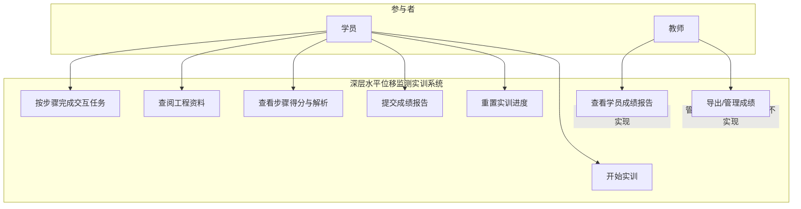

# 深层水平位移监测实训系统 · 产品用例图

> **版本**：V1.1  
> **更新日期**：2026-06-04  
> **关联 PRD**：`.cursor/prd/productlog.md`  
> **投标技术参数**：`.doc/投标技术参数.md`

---

## 1. 系统边界用例图

---

## 2. 学员主流程用例图

```mermaid
flowchart LR
    Start([进入系统]) --> UC_Start[浏览任务说明并开始]
    UC_Start --> M1

    subgraph M1["监测与准备 Q01-Q07 / 25分"]
        Q01[前期技术准备]
        Q02[取料区域]
        Q03[管材拼装]
        Q04[导管安装到钢筋笼]
        Q05[管口验收]
        Q06[通畅性测试]
        Q07[初测基准测量]
    end

    M1 --> M2

    subgraph M2["数据采集 Q08-Q09 / 32分"]
        Q08[测前准备与安全防护]
        Q09[读数仪设置与数据采集]
    end

    M2 --> M3

    subgraph M3["数据处理 Q10-Q12 / 43分"]
        Q10[数据导入与预处理]
        Q11[监测日报表填写]
        Q12[多期数据分析与预警]
    end

    M3 --> UC_Submit[提交成绩报告]
    UC_Submit --> End([查看总成绩与明细])
```

---

## 3. 包含关系（Include）用例

| 基础用例 | 包含用例 | 说明 |
|----------|----------|------|
| 完成任意步骤任务 | 保存答题状态 | localStorage 自动持久化 |
| 完成步骤任务 | 自动评分 | 单选/多选/填空即时判分 |
| 读数仪数据采集 Q09 | 模拟 CX-03E 操作流程 | 测区/孔号/孔深/步长/正反测 |
| 多期分析 Q12 | 查看多期曲线 | ECharts 变形曲线对比 |
| 查阅工程资料 | 打开 PDF 资料 | 背景/仪器/管材/GB50497 |

---

## 4. 扩展关系（Extend）用例

| 扩展用例 | 触发条件 | 基础用例 |
|----------|----------|----------|
| 查看题目解析 | 答题错误或提交后 | 完成步骤任务 |
| 重置当前实训 | 学员主动操作 | 实训会话管理 |
| 开发调试面板 | Ctrl+Shift+Alt+K | 系统维护（非学员必需） |
| 线框需求对照 | 开启线框模式 | UI 走查 |

---

## 5. 用例清单表

| 用例编号 | 用例名称 | 主要参与者 | 优先级 |
|:--------:|----------|:----------:|:------:|
| UC-01 | 开始实训 | 学员 | P0 |
| UC-02 | 完成 12 步交互任务 | 学员 | P0 |
| UC-03 | 查阅工程与标准资料 | 学员 | P1 |
| UC-04 | 查看步骤得分与解析 | 学员 | P0 |
| UC-05 | 提交并查看成绩报告 | 学员 | P0 |
| UC-06 | 重置实训进度 | 学员 | P2 |
| UC-07 | 查看学员成绩（教师端） | 教师 | P1 |
| UC-08 | 成绩导出与管理（教师端） | 教师 | P2 |

---

## 版本记录

| 版本 | 日期 | 变更 |
|------|------|------|
| V1.0 | 2026-06-04 | 初版用例图，与 productlog V1.0 对齐 |
| V1.1 | 2026-06-04 | 增加投标技术参数文档交叉引用 |
