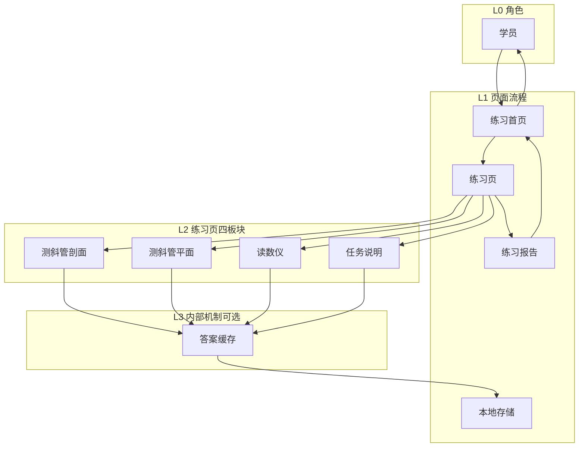
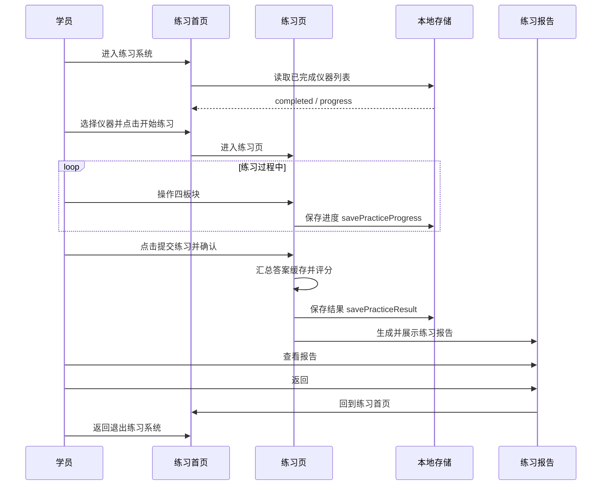
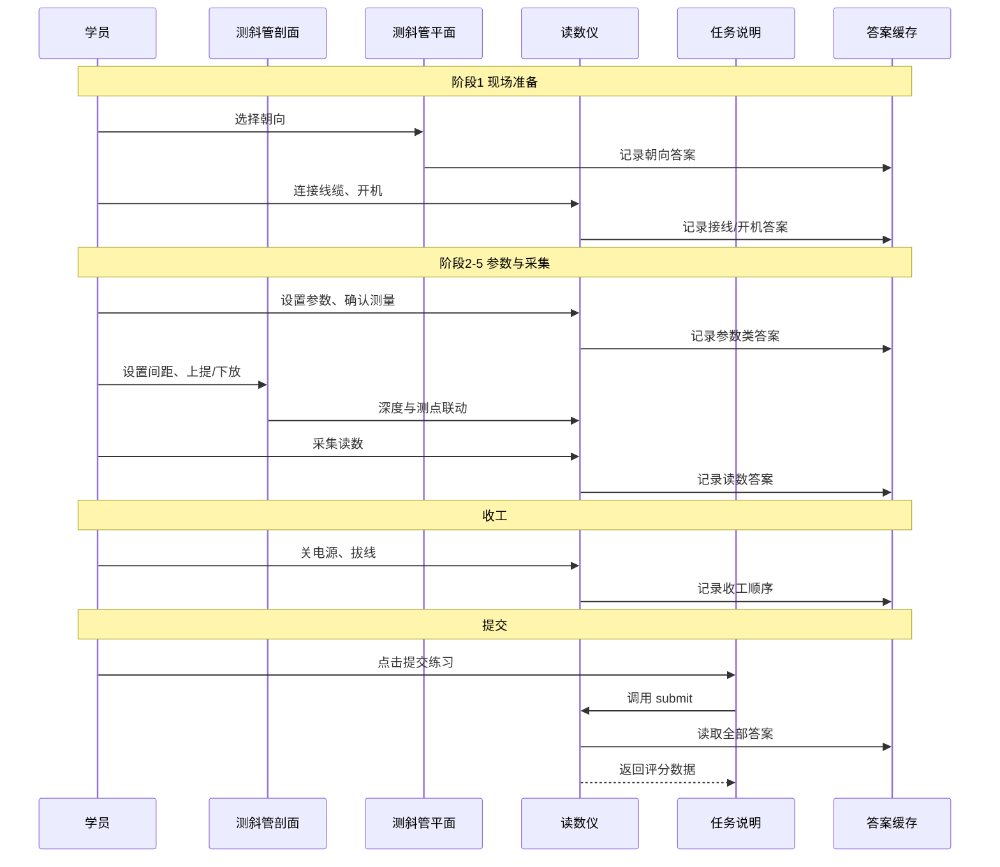

# 练习模式全流程 — 对象与时序图

> **对应功能**：练习模式（测斜仪专项练习）  
> **实现文件**：`src/components/practice/PracticeSession.tsx`、`src/components/steps/Step9_InstrumentSetting.tsx`  
> **本地存储**：`src/lib/practiceStorage.ts`  
> **Step9 交互细节**：[读数仪交互逻辑.md](./读数仪交互逻辑.md)  
> **单一事实来源**：`src/data/requirements/step09InteractionFlows.ts`（`PRACTICE_FLOW_*` 常量）  
> **更新**：2026-06-22

本文档定义「从进入练习系统 → 完成练习 → 退出系统」的对象命名、分层规则，以及主流程时序图与练习页四板块展开图。

---

## 1. 核心原则

- **一张图只用一个层级**，不要把「页面」和「四板块」混在同一 participant 行里。
- **练习页 = 4 个板块**：剖面、平面、读数仪、任务说明。
- **跨页持久化**单独画：`本地存储`（`practiceStorage.ts`）。
- **弹窗**（提交确认、采集表、参数设置）不单独做 participant，归触发它的板块。

---

## 2. 对象分层



| 文档对象 | 代码 | 层级 | 职责 |
|----------|------|------|------|
| **学员** | — | L0 | 操作者 |
| **练习首页** | `PracticeHub` | L1 | 选仪器、看任务摘要、点「开始练习」、显示已完成标记 |
| **练习页** | `PracticeSession` + `InstrumentSetting` | L1 | 一次练习的主界面；内含四板块 |
| **练习报告** | `ReportPage variant="practice"` | L1 | 展示得分与错题 |
| **本地存储** | `practiceStorage` | L1 | 进度 `progress`、结果 `results`、完成列表 `completed` |
| **测斜管剖面** | Step9 左栏 | L2 | 深度、间距、上提/下放、采集表 |
| **测斜管平面** | Step9 `planeView` | L2 | 朝向选择（W 靠齐等） |
| **读数仪** | Step9 `deviceView` | L2 | 接线、LCD、按键、电源、采集、收工 |
| **任务说明** | `practicePanel` 右栏 | L2 | 题目说明、「提交练习」按钮 |
| **答案缓存** | `recordedAnswersRef` | L3 | 运行时记答案，提交时读取 |

**不再使用的名称**（避免混淆）：

- 不要用「读数仪」指整步 Step9
- 不要用「测斜监测操作」与四板块并列出现在同一张图里（要么当练习页黑盒，要么展开成四板块）

**入口说明**（与代码一致）：当前练习入口为开发浮窗「进入练习系统」→ `practiceHub`；`StartPage` 的「开始实训」走实训路径，不是练习路径。主流程图可从 **练习首页** 开始；若需完整「打开应用」，可加 **系统首页** participant。

---

## 3. 图 A：主流程（进入 → 完成 → 退出）

**Participant 行（推荐 5 个）：**

```text
学员 | 练习首页 | 练习页 | 本地存储 | 练习报告
```

说明：此处的 **练习页** 是黑盒，不展开四板块。



**页面跳转对照**（`App.tsx` / `PracticeSession.tsx`）：

| 步骤 | appView / 状态 |
|------|----------------|
| 练习首页 | `practiceHub` |
| 练习页 | `practiceSession` |
| 练习报告 | `PracticeSession` 内 `showReport` |
| 退出练习 | `practiceHub` → `start` |

---

## 4. 图 B：练习页内流程（四板块展开）

**Participant 行（推荐 6 个）：**

```text
学员 | 测斜管剖面 | 测斜管平面 | 读数仪 | 任务说明 | 答案缓存
```

本地存储可在「提交」时由 **任务说明** 或 **读数仪**（Step9 submit）侧写入；展开图里加 `本地存储` 亦可，共 7 个 participant。



**消息归属规则**：

| 学员动作 | 发给谁 |
|----------|--------|
| 选 W 靠齐 | 测斜管平面 |
| 设间距、上提/下放 | 测斜管剖面 |
| 接线、LCD、采集、收工 | 读数仪 |
| 提交练习 | 任务说明 → 读数仪 submit |

LCD 逐屏细节见 [读数仪交互逻辑.md §4–5](./读数仪交互逻辑.md)。

---

## 5. 两张图的关系

```text
图 A（主流程）里的「练习页」黑盒
        │
        │ 展开
        ▼
图 B（四板块 + 答案缓存）
```

写文档时：**先图 A 讲全流程，再图 B 讲 Step9 交互细节**，不要合并成一张 10 个 participant 的大图。

---

## 6. 与代码常量（单一事实来源）

Mermaid 与 participant 定义以 [`step09InteractionFlows.ts`](../src/data/requirements/step09InteractionFlows.ts) 中 `PRACTICE_FLOW_*` 为准：

| 常量 | 内容 |
|------|------|
| `PRACTICE_FLOW_OBJECTS` | 对象分层表（L0–L3） |
| `PRACTICE_FLOW_MAIN_PARTICIPANTS` | 图 A participant 行 |
| `PRACTICE_FLOW_DETAIL_PARTICIPANTS` | 图 B participant 行 |
| `PRACTICE_FLOW_HIERARCHY_MERMAID` | §2 分层 flowchart |
| `PRACTICE_FLOW_MAIN_SEQUENCE_MERMAID` | §3 图 A |
| `PRACTICE_FLOW_DETAIL_SEQUENCE_MERMAID` | §4 图 B |
| `PRACTICE_FLOW_MESSAGE_ROUTING` | §4 消息归属表 |

[`读数仪交互逻辑.md`](./读数仪交互逻辑.md) §10 含交叉引用；`exportStep09InteractionJson()` 的 `practiceFlow` 字段供 HTML 内嵌。

**答案缓存物理位置**：运行时 `recordedAnswers` / `recordedAnswersRef`（内存）；`onProgress` 镜像至 `localStorage.progress`；提交练习写入 `localStorage.results`。
