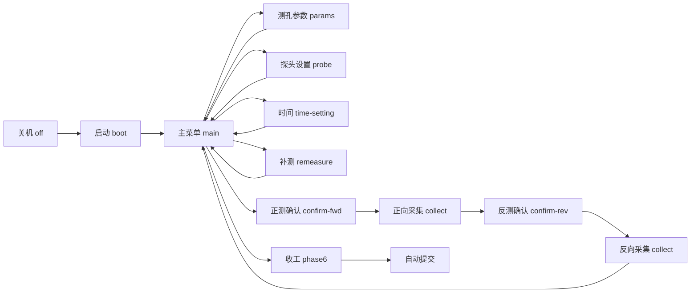

# 读数仪设置与数据采集 — 交互逻辑说明

> **对应步骤**：Q09 · `acq.instrument`  
> **实现文件**：`src/components/steps/Step9_InstrumentSetting.tsx`  
> **数据期次**：监测数据表第 6 期（`monitoringPeriodData.csv`）  
> **打印版**：[docs/step09-instrument-interaction.html](../docs/step09-instrument-interaction.html)（浏览器打开后可打印 / 导出 PDF）  
> **单一事实来源**：`src/data/requirements/step09InteractionFlows.ts`  
> **更新**：2026-06-04

本文档采用「整体布局 + 逐屏流程 + 初始状态 / 交互说明」版式，对齐投标交互说明图结构；内容以当前 Step9 实现为准。

---

## 1. 整体界面布局

| 区域 | 内容 | 解锁条件 |
|------|------|----------|
| D1–D3 测斜管剖面图 | 深度刻度 0–20 m、探头位置动画、测量间距按钮、▲ 上提 / ▼ 下放、📋 采集表 | fieldUnlocked=true 后可操作 |
| M1–M3 测斜管平面图 | 探头旋转 ±90°、确定朝向、N/E/S/W 靠齐热点 | fieldUnlocked=true 后可操作 |
| I1–I7 读数仪本体 | LCD 屏、← OK ↑ ↓ 导航键、DC 充电口、探头口（线材）、USB 口、⏻ 电源键 | 始终可操作（关机时仅电源/探头口） |

**fieldUnlocked**：进入「开始新的测量」或正/反测确认后解锁剖面图与平面图；此前灰色禁用。

## 2. 与参考图的差异

- 现版无 + / − / 红色 Record 键；参数调节用 ↑↓
- 菜单为「测孔参数设置」「探头设置」，非参考图中的测站/传感器参数
- 记点动作为稳定倒计时结束后按 OK，非 Record 键
- 现场布置（朝向、靠齐、间距）在 Web 平面图/剖面区完成，非 LCD 内设置

## 3. 物理控件一览

| 控件 | 作用 |
|------|------|
| ← 返回 | params/probe/time/remeasure/confirm 屏返回主菜单；收工阶段无效 |
| OK 确认 | 进入子菜单、保存参数、开始测量、稳定后记点 |
| ↑ / ↓ | 主菜单/字段列表移动光标；编辑态下增减数值或切换选项 |
| ⏻ 电源 | 开机（3s 启动画面）/ 关机；phase≥5 收工时先关机 |
| 探头口 | 未连接时打开线材选型弹窗；phase≥5 收工时拔线 |
| 剖面 ▲ 上提 | 上提提示态下推进下一手测点；否则浏览深度 |
| 剖面 ▼ 下放 | 浏览深度（自动采集中可改显示，不记读数） |
| 平面图热点 | 确认朝向后点击 N/E/S/W 选择线材靠齐方位 |

## 4. LCD 界面总流转



## 5. 逐屏交互说明

### 4.1 关机 / 线材连接（`off`）

**屏显**

```
┌─────────────────────────┐
│ （LCD 熄灭）
│ 
│ 探头口: ○ 未连接
└─────────────────────────┘
[←] [OK] [↑] [↓]
```

**初始状态**

- phase = 1
- isPoweredOn = false，lcdScreen = off
- isConnected = false
- 剖面图 / 平面图灰色禁用（fieldUnlocked = false）

**交互说明**

| 操作 | 行为 |
|------|------|
| 点击探头口 | 打开线材选型弹窗（四选一图文卡） |
| 弹窗确认 | isConnected = true，探头口变蓝 ●；记录 acq.instrument.cable |
| ⏻ 电源（未接线） | 可开机但记录 powerBeforeConnect（错误顺序） |
| ⏻ 电源（已接线） | 记录 connectBeforePower（正确顺序），进入启动画面 |

**界面跳转**

- → **启动画面**：已接线后按电源键开机
- → **线材弹窗**：点击未连接的探头口


### 4.2 启动画面（`boot`）

**屏显**

```
┌─────────────────────────┐
│ 
│ 欢迎使用
│ 数字式测斜仪
│ 
└─────────────────────────┘
[←] [OK] [↑] [↓]
```

**初始状态**

- booting = true，约 3 秒
- 导航键无效

**交互说明**

| 操作 | 行为 |
|------|------|
| （无） | 自动计时，不可操作 |

**界面跳转**

- → **主菜单**：3 秒后自动进入 main


### 4.3 主菜单（`main`）

**屏显**

```
┌─────────────────────────┐
│ 欢迎使用          MM-DD HH:MM
│ > 1. 开始新的测量
│   2. 测孔参数设置
│   3. 探头设置
│   4. 补测数据点
│   5. 时间设置
└─────────────────────────┘
[←] [OK] [↑] [↓]
```

**初始状态**

- phase ≥ 2（已开机；接线+开机后自动 phase 2）
- cursor = 0，fieldUnlocked = false
- paramsSaved / probeSaved 未齐时仍可浏览菜单

**交互说明**

| 操作 | 行为 |
|------|------|
| ↑ / ↓ | 在五项菜单间移动光标（循环） |
| OK · 1 | 清空采集表 → confirm-fwd，fieldUnlocked = true |
| OK · 2 | 进入测孔参数设置 params |
| OK · 3 | 进入探头设置 probe |
| OK · 4 | 进入补测 remeasure |
| OK · 5 | 进入时间设置 time-setting |

**界面跳转**

- → **测孔参数**：cursor=1，OK
- → **探头设置**：cursor=2，OK
- → **正测确认**：cursor=0，OK
- → **补测**：cursor=3，OK
- → **时间设置**：cursor=4，OK

**Web 区补充**

- phase 2 且 paramsSaved && probeSaved 后自动进入 phase 3


### 4.4 测孔参数设置（`params`）

**屏显**

```
┌─────────────────────────┐
│ 测孔参数设置      MM-DD HH:MM
│ > 测区编号:        01
│   孔  号:          01
│   孔  深:          25 m
│       [保存]
└─────────────────────────┘
[←] [OK] [↑] [↓]
```

**初始状态**

- 默认测区 01 / 孔 01 / 孔深 25 m（故意错误）
- 任务正确值：03 / 06 / 20 m
- cursor = 0，editingField = null

**交互说明**

| 操作 | 行为 |
|------|------|
| ↑ / ↓ | 在四个焦点（三字段 + 保存）间移动 |
| OK（字段） | 进入编辑态 editingField = cursor |
| ↑ / ↓（编辑） | 测区 01–05、孔号 01–10、孔深 1–50 增减 |
| OK（编辑） | 退出编辑态 |
| OK（保存） | 记录 area/hole/depth，paramsSaved=true，回主菜单 |
| ← | 不保存，回主菜单 cursor=1 |

**界面跳转**

- → **主菜单**：保存或 ← 返回


### 4.5 探头设置（`probe`）

**屏显**

```
┌─────────────────────────┐
│ 探头设置          MM-DD HH:MM
│ > 方向:            向下
│   校正:            0.00
│   步长:            1.0m
│       [保存]
└─────────────────────────┘
[←] [OK] [↑] [↓]
```

**初始状态**

- 默认方向向下、步长 1.0 m（故意错误）
- 任务正确值：向上 / 0.5 m
- 校正默认 0.00，范围 ±9.99

**交互说明**

| 操作 | 行为 |
|------|------|
| ↑ / ↓ | 在四个焦点间移动 |
| OK（字段） | 进入编辑态 |
| ↑ / ↓（方向） | 切换 向上 / 向下 |
| ↑ / ↓（校正） | 步进 ±0.01 |
| ↑ / ↓（步长） | 在 0.5 / 1.0 / 1.5 / 2.0 m 循环 |
| OK（保存） | 记录 probeDirection/stepLength，probeSaved=true，回主菜单 |
| ← | 不保存，回主菜单 cursor=2 |

**界面跳转**

- → **主菜单**：保存或 ← 返回；两参数均已保存后 phase→3


### 4.6 时间设置（`time-setting`）

**屏显**

```
┌─────────────────────────┐
│ 时间设置          MM-DD HH:MM
│ > 年:              2026
│   月:              06
│   日:              04
│   时:              12
│   分:              00
│       [确认]
└─────────────────────────┘
[←] [OK] [↑] [↓]
```

**初始状态**

- 显示系统当前时间（只读，不可编辑）
- 不参与评分

**交互说明**

| 操作 | 行为 |
|------|------|
| ↑ / ↓ | 在六个时间字段与 [确认] 间移动光标 |
| OK（确认） | 回主菜单 cursor=4 |
| ← | 回主菜单 cursor=4 |

**界面跳转**

- → **主菜单**：确认或 ←


### 4.7 正向测量确认（`confirm-fwd`）

**屏显**

```
┌─────────────────────────┐
│ 即将进行         MM-DD HH:MM
│ 
│     正向测量
│ 
│   按OK键开始测量
│   请先完成现场布置
└─────────────────────────┘
[←] [OK] [↑] [↓]
```

**初始状态**

- fieldUnlocked = true
- probeRotation = 0°，rotationConfirmed = false
- cableAlignment = null，monitorInterval 未设
- 未完成布置时 OK 无效，LCD 显示红色提示

**交互说明**

| 操作 | 行为 |
|------|------|
| 平面图 ±90° | 调整探头旋转 0/90/180/270° |
| 平面图 确定 | rotationConfirmed = true，显示 N/E/S/W 热点 |
| 热点 N/E/S/W | 二次确认后写入 cableAlignment（正测正确：W） |
| 剖面 测量间距 | 弹窗单选 0.5/1.0/1.5/2.0 m（正确 0.5 m） |
| OK（布置完成） | 记录朝向/靠齐/间距 → collect，phase→4，深度 20.0 m，启动 30s 稳定 |
| ← | 回主菜单，fieldUnlocked = false |

**界面跳转**

- → **正向采集**：rotationConfirmed && cableAlignment && monitorInterval，按 OK
- → **主菜单**：← 返回

**Web 区补充**

- 正测要求 A 向（0°）+ W 靠齐 + 0.5 m 间距


### 4.8 正向采集（`collect`）

**屏显**

```
┌─────────────────────────┐
│ 正向测量         MM-DD HH:MM
│  20.0m              孔06
│  +0.42°             组01
│  +3.65mm            ☒01
└─────────────────────────┘
[←] [OK] [↑] [↓]
```

**初始状态**

- measureType = forward，manualPoint = 0
- 手测 5 点：20.0 / 19.5 / 19.0 / 18.5 / 18.0 m
- 首点稳定 30 s，其余各 5 s；稳定前读数带抖动

**交互说明**

| 操作 | 行为 |
|------|------|
| （等待） | 倒计时结束 → isStable = true |
| OK（稳定后） | 记录当前深度读数到采集表 |
| 剖面 ▲ 上提 | showMovePrompt 时出现；推进下一测点并重启倒计时 |
| OK（上提提示态） | 亦可确认（与 ▲ 配合） |
| 第 5 点 OK 后 | 自动采集剩余深度（约 1.5 s） |

**界面跳转**

- → **上提提示**：manualPoint < 4，记点后
- → **反向确认**：第 5 点记点后 autoCollect 完成

**Web 区补充**

- 深度公式（向上）：currentDepth = 20 − manualPoint × stepLength
- 读数来源：monitoringPeriodData 第 6 期 A+


### 4.9 反向测量确认（`confirm-rev`）

**屏显**

```
┌─────────────────────────┐
│ 即将进行         MM-DD HH:MM
│ 
│     反向测量
│ 
│   按OK键开始测量
│   请重新选择靠齐方位
└─────────────────────────┘
[←] [OK] [↑] [↓]
```

**初始状态**

- 正测 autoCollect 后约 1.5 s 自动进入
- probeRotation = 180°，rotationConfirmed = true（A−）
- cableAlignment 已清空，需重新选择
- monitorInterval 可沿用正测已设值

**交互说明**

| 操作 | 行为 |
|------|------|
| 平面图热点 | 重新选择靠齐方位 |
| OK（靠齐已选） | 开始反测 collect；深度 20.0 m，30s 稳定 |
| ← | 回主菜单 |

**界面跳转**

- → **反向采集**：cableAlignment 已选，按 OK


### 4.10 反向采集 / 自动补全（`collect`）

**屏显**

```
┌─────────────────────────┐
│ 反向测量         MM-DD HH:MM
│ 
│   正在测量剩余测点…
│   （autoCollecting）
└─────────────────────────┘
[←] [OK] [↑] [↓]
```

**初始状态**

- 手测 5 点流程同正测，读数取 A−
- 12.5 m 反测读数故意 +8 mm（校验和超 5 mm）
- 第 5 点记点后 autoCollect 填充全部反测列

**交互说明**

| 操作 | 行为 |
|------|------|
| 手测阶段 | 同正向采集（OK 记点 + ▲ 上提） |
| autoCollecting | LCD 显示「正在测量剩余测点…」，导航键无效 |
| 完成后 | 回主菜单，phase→5，fieldUnlocked=false |

**界面跳转**

- → **主菜单**：反测 autoCollect 完成
- → **补测**：学员发现 12.5 m 校验和异常，主菜单选「补测数据点」

**Web 区补充**

- 校验和 = round(正测 + 反测, 2) mm；阈值 5 mm
- 可点 📋 采集表查看全表 41 行


### 4.11 补测数据点（`remeasure`）

**屏显**

```
┌─────────────────────────┐
│ 补测位点          MM-DD HH:MM
│ > 组号:            05
│   深度:            3.0m
│   方向:            正测
│     [开始补测]
└─────────────────────────┘
[←] [OK] [↑] [↓]
```

**初始状态**

- 默认组号 05 / 深度 3.0 m / 方向 正测（故意偏离）
- 任务正确：05 组 / 12.5 m / 反测
- phase ≥ 5 可用

**交互说明**

| 操作 | 行为 |
|------|------|
| ↑ / ↓ | 在组号/深度/方向/[开始补测] 间移动 |
| OK（字段） | 进入编辑；组号 01–99，深度 0–20 步进 0.5 m |
| ↑ / ↓（方向） | 切换 正测 / 反测 |
| OK（开始补测） | 记录三组参数 → collect 模拟 5 s → 用无偏差真值覆盖 → 回主菜单 |
| ← | 回主菜单 cursor=3 |

**界面跳转**

- → **采集（模拟）**：开始补测
- → **主菜单**：补测完成或 ←


### 4.12 收工（`main / off`）

**屏显**

```
┌─────────────────────────┐
│ （phase 5 完成后）
│ 点击「进入收工阶段」→ phase 6
│ 
│ 1. ⏻ 关机 → LCD 熄灭
│ 2. 探头口拔线 → ○
│ → 自动提交本步成绩
└─────────────────────────┘
[←] [OK] [↑] [↓]
```

**初始状态**

- 反测完成且回主菜单后 phase = 5
- 点击收工按钮后 phase = 6
- cleanupDone.power / cable 均为 false

**交互说明**

| 操作 | 行为 |
|------|------|
| 进入收工阶段 | phase → 6（Web 区按钮） |
| ⏻ 电源 | 关机，记录「关闭电源」 |
| 探头口 | 拔线，记录「拔除线材」 |
| 顺序要求 | 必须先关机再拔线（cleanupOrder） |

**界面跳转**

- → **自动提交**：关机且拔线均完成 → onNext()


## 6. 现场布置（Web 区，非 LCD）

| 步骤 | 操作 | 正测要求 |
|------|------|----------|
| 1 | 平面图旋转 ±90° 后点「确定」 | A 向（0°） |
| 2 | 点击 N/E/S/W 热点并确认 | W 靠齐 |
| 3 | 剖面区点「测量间距」弹窗 | 0.5 m |
| 反测 | 靠齐方位清空，需重新选择 | 朝向自动 180°（A−） |

## 7. 采集表与校验和

- 行数：`20 / stepLength + 1`（步长 0.5 m → 41 行，0.0–20.0 m）
- 列：深度、组号（05）、正测、反测、校验和
- 校验和 = `round(正测 + 反测, 2)` mm
- **12.5 m 反测**故意 +8 mm，使校验和 > 5 mm，引导补测（05 组 / 12.5 m / 反测）

## 8. 读数显示（简）

- 真值：`monitoringPeriodData.csv` 第 6 期 A+ / A−
- 抖动与角度公式详见 [jitter-formula-playground.html](../docs/jitter-formula-playground.html)

## 9. 任务正确配置速查

| 项目 | 值 |
|------|-----|
| 线材 | 5 针圆形航空插头（A） |
| 开机顺序 | 先接线，后开机 |
| 测区 / 孔号 / 孔深 | 03 / 06 / 20 m |
| 探头方向 / 步长 | 向上 / 0.5 m |
| 正测朝向 / 靠齐 / 间距 | A 向(0°) / W / 0.5 m |
| 手测深度 | 20.0 → 18.0 m（5 点） |
| 补测 | 05 组 / 12.5 m / 反测 |
| 收工顺序 | 先关电源，再拔线 |
